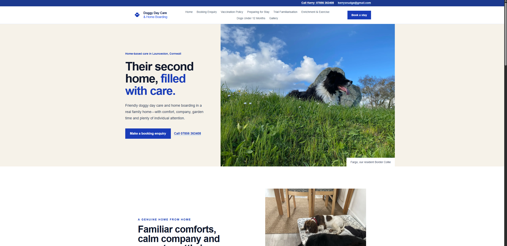
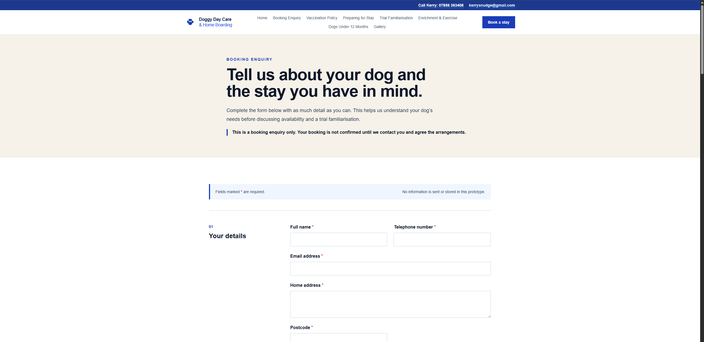

# Doggy Day Care & Home from Home Boarding

An early-stage website for a small, independent dog daycare and home boarding business in Launceston, Cornwall. The project focuses on presenting the business as a warm, personal alternative to commercial kennels while making essential information and booking enquiries easy to access.

**[View the live preview](https://doggy-daycare-woad.vercel.app/)**

> **Project status:** Active development. The public-facing design and static booking-enquiry experience are in place; backend form submission and the remaining information pages are still to be built.

## Screenshots

### Homepage

[]([https://www.launcestondogboarding.com/])

### Booking enquiry

[](https://doggy-daycare-woad.vercel.app/booking-enquiry)

## Current features

- Responsive, photography-led homepage using genuine client imagery
- Shared desktop and mobile navigation, contact strip, and footer
- Prominent click-to-call and email contact options
- Business address, directions, insurance, and licence information
- Static booking enquiry form organised into accessible sections
- Support for multiple dogs in one household
- Conditional medical, medication, allergy, insurance, microchip, and behaviour fields
- Per-dog permissions and care consent questions
- Client-side/native validation and a review-before-submit step
- Responsive images served through `next/image`
- Semantic HTML and visible keyboard focus states

The booking form is currently a UX prototype. It validates entries in the browser but deliberately does not send, email, or store personal information.

## Technology

- [Next.js 16](https://nextjs.org/) with the App Router
- [React 19](https://react.dev/)
- TypeScript
- Tailwind CSS 4
- Vercel deployment

No external component library, database, authentication system, or form service has been introduced at this stage.

## Main routes

| Route | Purpose |
| --- | --- |
| `/` | Business homepage, services, contact details, and directions |
| `/booking-enquiry` | Interactive static booking-enquiry prototype |

The navigation also includes planned routes for policies, preparation guidance, familiarisation, enrichment, young dogs, and the gallery. These pages are not implemented yet.

## Running locally

Requirements: Node.js 20 or later and npm.

```bash
git clone https://github.com/jds2909/doggy-daycare.git
cd doggy-daycare
npm install
npm run dev
```

Open [http://localhost:3000](http://localhost:3000).

Useful commands:

```bash
npm run lint
npm run build
npm start
```

## Project structure

```text
app/
  booking-enquiry/       Booking enquiry route
  layout.tsx             Shared metadata and root layout
  page.tsx               Homepage
components/
  booking-enquiry-form.tsx
  site-header.tsx
  site-footer.tsx
public/photos/           Photography used by the site
docs/screenshots/        README screenshots
```

## Planned work

- Connect the enquiry form to a secure backend and email workflow
- Add server-side validation and appropriate data-handling safeguards
- Build the remaining policy and visitor-information pages
- Add the client’s final line-drawing logo
- Create the full gallery
- Complete cross-browser and device testing

## Context

This is a bespoke client project rather than a generic template. Its visual direction was developed around the business’s real home environment, resident Border Collie, garden, walks, and small-scale approach to dog care.
